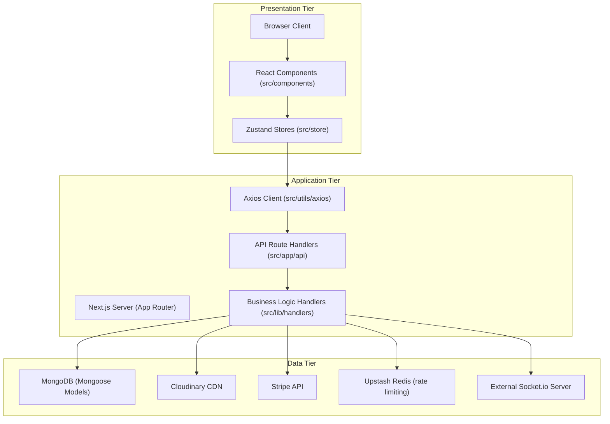

# 🧳 BD Travel Spirit — Support System

> A comprehensive **admin & support operations dashboard** for Bangladesh's travel ecosystem — managing guides, companies, employees, tours, travelers, articles, payments, and real-time support — built with **Next.js (App Router)**, **React**, **TypeScript**, **MongoDB (Mongoose)**, and **NextAuth**.

---

## 📌 Overview

BD Travel Spirit Support System is the **central operations hub** for platform owners and support staff, covering the complete lifecycle of a Bangladesh-focused travel marketplace: guide onboarding & verification, employee/payroll management, tour & article moderation, traveler administration, real-time customer chat, notifications and payments — scoped to Bangladesh's divisions (Dhaka, Chittagong, Sylhet, Cox's Bazar, Sundarbans, etc.).

The product surface has two halves:
- A **public "Join as Guide" landing page** with live platform stats (`totalGuides`, `monthlyVisitors`, `totalDestinations`).
- A **secured internal dashboard** (NextAuth, JWT sessions) restricted to `ADMIN` and `SUPPORT` roles, used to moderate content, approve guides/tours, resolve password resets, chat with users, and monitor analytics.

---

## 🚀 Features

<details>
<summary><strong>🧭 Tour Management</strong></summary>

- 40+ field tour schema covering destinations, itineraries, pricing, and policies
- Multi-level caching (entity + query-based)
- Rich detail pages: hero images, galleries, videos, SEO metadata
- Review & report moderation with status tracking
- FAQ system with voting, reporting, moderation
- Lifecycle actions: approve, reject, suspend, unsuspend
</details>

<details>
<summary><strong>🧑‍✈️ Guide Management & Recruitment</strong></summary>

- Public "Join as Guide" portal with real-time stats
- 4-step registration: Personal Info → Company Details → Documents → Review & Submit
- Bangladesh-specific validation (district/division matching, 4-digit postal codes)
- Draft persistence to `localStorage`, resumable via emailed access token
- Guide application review/approval, document verification, password requests, subscription tiers
</details>

<details>
<summary><strong>🏢 Company & Employee Management</strong></summary>

- Company overview with KPIs, tour/employee counts, ratings
- Full employee CRUD with detailed profiles
- Shift tracking, salary history, 30-day payroll cycle
- Employee password-reset workflow with admin approval
</details>

<details>
<summary><strong>👤 Traveler Management</strong></summary>

- Traveler profiles with Bangladesh address schema (District, Upazila, Union, Ward)
- Admin actions: suspend, lock, unsuspend
- Multi-tab activity view: bookings, reviews, reports, FAQs
</details>

<details>
<summary><strong>💬 Real-Time Chat & Support</strong></summary>

- Normalized message cache with optimistic updates
- Bidirectional support-traveler conversations
- Message moderation status
- Support stats: total messages, flagged content, unread volume
</details>

<details>
<summary><strong>🔔 Real-Time Notifications & Socket System</strong></summary>

- "Trigger–Persist–Emit" architecture: events persisted to Mongo, then broadcast via an external Socket.io server
- Role-segmented notifications (admin, traveler, guide)
- Priority-based expiration
- Cron-driven booking reminder emails + socket pushes
</details>

<details>
<summary><strong>📝 Content Management (Articles & Comments)</strong></summary>

- Travel article CMS with structured multi-destination content
- SEO optimization: meta tags, OG images, reading-time calculation
- Threaded/nested comments with moderation workflow (`PENDING`/approve/reject with reason)
</details>

<details>
<summary><strong>🖼️ Asset & Media Management</strong></summary>

- Centralized upload pipeline to Cloudinary
- SHA256-based deduplication
- Supports `image/jpeg`, `image/png`, `application/pdf`
- Reference counting + transaction-safe asset resolution
</details>

<details>
<summary><strong>💳 Payments</strong></summary>

- Stripe-based payment account creation and webhook handling
- Transaction history endpoint
</details>

<details>
<summary><strong>⚙️ Site Settings & Configuration</strong></summary>

- Guide banner settings, footer settings
- Enum group settings (configurable dropdown values)
- Guide subscription tier configuration
</details>

<details>
<summary><strong>📊 Dashboard, Analytics & AI</strong></summary>

- Multi-tab analytics dashboard: KPIs, users, tours, reviews, reports, images, notifications, chat, employees
- Section-based independent refresh
- Interactive charts (Recharts / Nivo)
- Built-in AI Chat Assistant for support staff
- ML/analytics: 11 interaction event types, dwell-time analysis, session tracking, `TourFeatures` popularity scoring, content embeddings, search-intent parsing, LIKE/DISLIKE/HIDE feedback loop
</details>

---

## 👥 User Roles

Access is governed by role-based access control (RBAC), enforced through NextAuth session callbacks and server-side `VERIFY_USER_ROLE` guards. Only `ADMIN` and `SUPPORT` may sign into the dashboard; `GUIDE`/`TRAVELER` sign-in attempts are rejected.

| Role | Scope | Description |
|------|-------|--------------|
| `ADMIN` | Full access | Employees, guide banners, owner data, subscriptions, all sensitive admin ops |
| `SUPPORT` | Restricted | Moderates comments/articles, handles chat & password-reset requests |
| `GUIDE` | External | Tour operators, registered via the public "Join as Guide" flow |
| `TRAVELER` | External | End users booking tours, managed *by* the dashboard |
| `ASSISTANT` | Company-scoped | Company support assistant (requires `companyId`) |

---

## 🏗️ Architecture



Route files under `src/app/api/**/route.ts` stay thin — they delegate the actual business logic to dedicated handler functions in `src/lib/handlers/**`, all wrapped in a common `withErrorHandler` for consistent error responses, and `withTransaction` for atomic multi-document writes.

---

## 🔌 API Reference

All production endpoints live under `src/app/api/` using Next.js App Router route handlers, versioned with a `v1` segment for stability. Every write handler enforces `VERIFY_USER_ROLE`, wraps multi-document writes in `withTransaction`, and returns a standardized `{ data, status }` JSON envelope; audit logs are recorded via `logAuditBestEffort` for sensitive mutations.

<details>
<summary><strong>🔑 Authentication & Session — <code>/api/auth/*</code>, <code>/api/[...nextauth]</code></strong></summary>

| Endpoint | Usage |
|---|---|
| `POST /api/auth/[...nextauth]` | NextAuth handler for Credentials + Google OAuth sign-in, session issuance |
| `POST /api/auth/user/v1/validate` | Pre-validates email/password before handing off to NextAuth's `authorize` callback (used by the login form to short-circuit invalid credentials and apply rate limiting) |
| `GET /api/auth/user/v1` | Fetches the current authenticated user's profile |
| `.../v1/password` | Change/set password for the logged-in user |
| `.../v1/reset-password` | Initiates/completes password reset flow (OTP-based for `ADMIN`) |
| `.../v1/employee` | Employee-specific auth/profile sub-resource |
| `.../v1/owner` | Owner-specific auth/profile sub-resource |
| `.../v1/name` | Lightweight lookup of a user's display name |
| `.../v1/audits` | Retrieves audit trail entries tied to the user |
| `GET/POST /api/auth/token/v1` | Issues/validates auxiliary tokens (e.g. email-verification / resumable-application access tokens) |

Auth is JWT-based (30-day session, 1-hour refresh) and rate-limited via Upstash Redis to block brute-force attempts.
</details>

<details>
<summary><strong>🧭 Support — Tours — <code>/api/support/tours/v1</code></strong></summary>

| Endpoint | Usage |
|---|---|
| `GET /api/support/tours/v1` | Lists tours for the moderation queue (filterable/paginated) |
| `GET/PATCH /api/support/tours/v1/[tourId]` | Fetches a single tour's full detail DTO (`buildTourDetailDTO`, deep-populated assets/guide/author + computed fields like `hasActiveDiscount`); PATCH drives approve/reject/suspend/unsuspend lifecycle actions |

A parallel mock namespace (`/api/(mock)/mock/support/tours[..]`) generates faker-based `TourDetailDTO` fixtures for local development without a DB connection.
</details>

<details>
<summary><strong>📝 Support — Articles — <code>/api/support/articles/v1</code></strong></summary>

| Endpoint | Usage |
|---|---|
| `POST /api/support/articles/v1` | Creates a travel article — uploads image assets to Cloudinary, generates a unique slug (`SlugService`), computes reading time, then persists via `TravelArticleModel.create()` inside a transaction |
| `GET /api/support/articles/v1/stats` | Returns aggregate article statistics for the dashboard |
| `GET/PATCH/PUT/DELETE /api/support/articles/v1/[articleId]` | Fetch, partially update, fully replace, or delete a specific article; deletions/edits trigger `logAuditBestEffort` |

Requires `VERIFY_USER_ROLE.ADMIN_OR_SUPPORT`.
</details>

<details>
<summary><strong>💬 Support — Article Comments — <code>/api/support/article-comments/v1</code></strong></summary>

| Endpoint | Usage |
|---|---|
| `GET /api/support/article-comments/v1` | Lists comments across articles for moderation |
| `.../v1/[articleId]` | Comments scoped to a specific article |
| `.../v1/comment` | Create/update a top-level comment |
| `.../v1/reply` | Create/update a threaded reply |
| `.../v1/stats` | Comment moderation statistics (pending, flagged, approved counts) |
| `PATCH .../status` | Moderates a comment's status; `PENDING` cannot be set manually, and rejections require a reason |
</details>

<details>
<summary><strong>🔐 Support — Password Reset Requests</strong></summary>

| Endpoint | Usage |
|---|---|
| `POST /api/support/employees-password-requests/v1` | Employee submits a password-reset request; rate-limited via `authRateLimit`, creates a `ResetPasswordRequestModel` doc, a `SupportSystemNotificationModel` entry, and triggers a real-time socket event (`SOCKET_TRIGGERS.SUPPORT_EMP_FORGOT_PASSWORD`) to the admin dashboard, all inside one transaction |
| `.../v1/[id]` | Admin approves/rejects a specific employee reset request |
| `POST /api/support/guide-password-requests/v1` | Same flow, scoped to guide accounts |
| `.../v1/[id]` | Approve/reject a specific guide reset request |
| `.../v1/stats` | Aggregate stats on pending/resolved guide password requests |
</details>

<details>
<summary><strong>💬 Support — User Chats — <code>/api/support/users/v1/chats</code></strong></summary>

| Endpoint | Usage |
|---|---|
| `GET/POST /api/support/users/v1/chats` | Fetches conversation lists/messages and sends new chat messages between support staff and travelers/guides; backs the real-time chat UI (moderation, read/delivered receipts) |
</details>

<details>
<summary><strong>👥 Users — Companies, Employees, Guides, Travelers</strong></summary>

| Endpoint | Usage |
|---|---|
| `GET /api/users/companies/v1` | Lists companies with KPIs (tours, employees, ratings) |
| `GET /api/users/companies/v1/[companyId]/detail` | Full company detail view (tours & employees drill-down) |
| `GET/POST /api/users/employees/v1` | Lists/creates employee records |
| `GET/PATCH/DELETE /api/users/employees/v1/[employeeId]` | Employee CRUD (profile, shifts) |
| `.../v1/payroll` | Payroll/salary-history endpoints (30-day cycle) |
| `GET/POST /api/users/guides/v1` | Lists guides / creates guide records (admin-side) |
| `GET/PATCH /api/users/guides/v1/[id]` | Fetch or update a specific guide (approve, suspend, verify documents) |
| `GET/POST /api/users/travelers/v1` | Lists travelers |
| `GET/PATCH /api/users/travelers/v1/[id]` | Traveler detail + admin actions (suspend/lock/unsuspend) |
</details>

<details>
<summary><strong>🧑‍✈️ Guide Applications — <code>/api/guide-applications/v1</code></strong></summary>

| Endpoint | Usage |
|---|---|
| `POST /api/guide-applications/v1` | Submits a new guide application (personal info, company details, documents) from the public registration wizard |
| `GET /api/guide-applications/v1/application` | Resumes a draft/submitted application by email + access token (`SearchApplication` flow) |
</details>

<details>
<summary><strong>⚙️ Site Settings — <code>/api/site-settings/*</code></strong></summary>

| Endpoint | Usage |
|---|---|
| `/api/site-settings/advertising` | CRUD for advertisement lifecycle (create, activate, expire ads) |
| `/api/site-settings/enums` | Manage configurable enum/dropdown groups used across forms |
| `/api/site-settings/footer` | Update footer content/links (incl. map-picker location data) |
| `/api/site-settings/guide-banners` | Manage promotional banners shown on the guide landing page |
| `/api/site-settings/guide-subscriptions` | Configure guide subscription tiers/pricing |
| `/api/site-settings/payment-accounts/v1` | Manage the platform's own payout/payment accounts |
</details>

<details>
<summary><strong>💳 Stripe & Transactions — <code>/api/(stripe)/*</code></strong></summary>

| Endpoint | Usage |
|---|---|
| `POST /api/stripe/webhook` | Receives and verifies Stripe webhook events (payment/payout status changes) |
| `GET /api/transactions` | Lists payment/payout transaction history for the admin dashboard |
</details>

<details>
<summary><strong>👑 Owner — <code>/api/(owner)/site-owner</code></strong></summary>

| Endpoint | Usage |
|---|---|
| `GET/PATCH /api/site-owner` | Manages the singleton "site owner" record (the top-level `ADMIN`'s identity/config used to target notifications and socket rooms) |
</details>

<details>
<summary><strong>📊 Dashboard — <code>/api/dashboard/v1/*</code></strong></summary>

| Endpoint | Usage |
|---|---|
| `.../v1/overview/v1` | Aggregated KPI summary for the dashboard landing tab |
| `.../v1/statistics/v1` (incl. `.../tours`) | Section-specific analytics (tours, users, reviews, reports, images, employees) with independent, on-demand refresh |
| `.../v1/notifications/v1` | Fetches admin-facing `SupportSystemNotificationModel` entries |
| `.../v1/ai-chat` / `.../v1/ai-chat/[sessionId]` | AI Chat Assistant endpoints — creates/continues a session for support-staff-facing AI help |
| `.../v1/search` | Global admin search across entities (tours, users, articles, etc.) |

A mock namespace (`/api/(mock)/mock/dashboard/*`) mirrors these endpoints with faker-generated data for local dashboard development.
</details>

<details>
<summary><strong>⏰ Cron Jobs — <code>/api/(cron)/cron/v1</code></strong></summary>

| Endpoint | Usage |
|---|---|
| `GET/POST /api/cron/v1/notify-booking-users` | Scheduled job (external cron trigger) that sends booking-reminder emails and pushes corresponding real-time socket notifications to affected travelers |
</details>

<details>
<summary><strong>🧪 Mock & Test Namespaces</strong></summary>

- `/api/(mock)/mock/**` — Faker-driven synthetic endpoints for tours and every dashboard section, used for local UI development without a live database.
- `/api/(test)/test/**` — Ad-hoc sandbox endpoints for manual feature testing during development; not intended for production use.
</details>

> ⚠️ **Note on coverage:** the exact HTTP methods and request/response bodies for every nested route (especially deeply nested ones like `.../v1/statistics/v1/tours`) were only partially inspected due to index size limits. For byte-exact request/response contracts, inspect the corresponding `route.ts` and its paired handler under `src/lib/handlers/**` directly, or start a Devin session with full repository access.

---

## 🛠️ Tech Stack

<details>
<summary><strong>Frontend</strong></summary>

| Category | Technology |
|-----------|-------------|
| Framework | Next.js (App Router) |
| UI Library | React 19 |
| State Management | Zustand (persistent, normalized caching) |
| Styling | Tailwind CSS 4 |
| UI Components | Radix UI + shadcn/ui |
| Animation | Framer Motion |
| Charts | Recharts, @nivo |
| Forms | React Hook Form + Formik + Zod resolvers |
| Maps | Leaflet / react-leaflet |
| Drag & Drop | @dnd-kit |
</details>

<details>
<summary><strong>Backend & Data</strong></summary>

| Category | Technology |
|-----------|-------------|
| Database | MongoDB with Mongoose |
| Authentication | NextAuth v5 (Credentials + Google OAuth), JWT, bcrypt/bcryptjs |
| Validation | Zod, Yup |
| Rate Limiting | Upstash Redis |
| Image/Asset Storage | Cloudinary |
| Payments | Stripe |
| Real-time | Socket.io client (external Express socket server) |
| AI | @google/generative-ai, groq-sdk |
| Error Tracking | Sentry |
| Email | Nodemailer |
| Type System | TypeScript |
</details>

---

## 📁 Project Structure

<details>
<summary><strong>Click to expand full folder structure</strong></summary>

```
bd-travel-spirit-support-system/
├── public/                              # Static assets, icons, manifest
├── src/
│   ├── app/
│   │   ├── api/
│   │   │   ├── (cron)/cron/v1/notify-booking-users/
│   │   │   ├── (mock)/mock/{support,dashboard}/    # Faker-driven dev endpoints
│   │   │   ├── (owner)/site-owner/
│   │   │   ├── (stripe)/{stripe/webhook,transactions}/
│   │   │   ├── (test)/test/
│   │   │   ├── auth/{[...nextauth],token,user}/v1/
│   │   │   ├── dashboard/v1/{overview,statistics,notifications,ai-chat,search}/
│   │   │   ├── guide-applications/v1/application/
│   │   │   ├── site-settings/{advertising,enums,footer,guide-banners,guide-subscriptions,payment-accounts}/
│   │   │   ├── support/{articles,tours,article-comments,users,guide-password-requests,employees-password-requests}/v1/
│   │   │   └── users/{companies,employees,guides,travelers}/v1/
│   │   ├── dashboard/                    # Admin/support dashboard pages
│   │   ├── register-as-guide/            # Guide registration flow
│   │   ├── setting/                      # Site & payment settings pages
│   │   ├── social/                       # Public/social content pages
│   │   ├── support/                      # Support staff tool pages
│   │   ├── users/                        # Guides/travelers/employees management pages
│   │   ├── layout.tsx / page.tsx         # Root layout & public landing page
│   │   └── robots.ts / sitemap.ts
│   │
│   ├── components/
│   │   ├── dashboard/, dashboard-layout/
│   │   ├── join-guide/, register-guide/
│   │   ├── setting/
│   │   ├── support/{chats,article-comments,articles,guide-password-request,reset-password-requests,tours}/
│   │   ├── users/
│   │   ├── shared/, global/, wrappers/    # Auth/Socket/Dashboard/Theme providers
│   │   └── ui/                            # shadcn/ui primitives
│   │
│   ├── models/
│   │   ├── ai-chat-bot/, articles/, assets/, employees/, guide/
│   │   ├── ml/                            # interactionEvent, tourFeatures, contentEmbedding, searchLog, recoFeedback
│   │   ├── notifications/, payments/, site-settings/, tours/, travelers/
│   │   ├── advertisement.model.ts, audit.model.ts, chat-message.model.ts
│   │   ├── email-verification-token.model.ts, owner.model.ts
│   │   ├── site-settings.model.ts, user.model.ts
│   │
│   ├── store/                            # Zustand stores (chat, article, guide, employee, etc.)
│   ├── lib/
│   │   ├── auth/                          # options.auth.ts, verify-user-role.ts
│   │   ├── handlers/                      # Business logic per API route
│   │   ├── build-responses/               # DTO builders (e.g. buildTourDetailDTO)
│   │   ├── html/                          # Transactional email templates
│   │   └── upstash-redis/                 # Rate limiting
│   ├── socket/                           # initiateSocket.ts, triggerSocketEvent.ts
│   ├── hooks/, data/, config/, constants/, types/, styles/, utils/
│
├── components.json, next.config.ts, eslint.config.mjs
├── postcss.config.mjs, tsconfig.json
├── package.json
└── README.md
```

</details>

---

## ⚙️ Environment Setup

```bash
# Database
MONGODB_URI=your_mongodb_connection_string

# NextAuth
NEXTAUTH_SECRET=your_nextauth_secret
NEXTAUTH_URL=http://localhost:3000
GOOGLE_CLIENT_ID=your_google_client_id
GOOGLE_CLIENT_SECRET=your_google_client_secret

# Cloudinary
CLOUDINARY_CLOUD_NAME=your_cloud_name
CLOUDINARY_API_KEY=your_api_key
CLOUDINARY_API_SECRET=your_api_secret

# Stripe
STRIPE_SECRET_KEY=your_stripe_secret_key
STRIPE_PUBLISHABLE_KEY=your_stripe_publishable_key

# Upstash Redis (rate limiting)
UPSTASH_REDIS_REST_URL=your_upstash_url
UPSTASH_REDIS_REST_TOKEN=your_upstash_token

# Socket server
SOCKET_SERVER_URL=your_socket_server_url
SOCKET_API_SECRET_KEY=your_socket_api_secret

# AI providers
GOOGLE_GENERATIVE_AI_API_KEY=your_gemini_api_key
GROQ_API_KEY=your_groq_api_key

# Email
SMTP_HOST=your_smtp_host
SMTP_USER=your_smtp_user
SMTP_PASS=your_smtp_password

# Optional: Sentry
SENTRY_DSN=your_sentry_dsn
```

---

## 📦 Installation

```bash
git clone https://github.com/ByteCrister/bd-travel-spirit-support-system.git
cd bd-travel-spirit-support-system
npm install
cp .env.example .env.local   # then fill in values as above
npm run dev
```

## 🚦 Available Scripts

```bash
npm run dev      # Start development server (Turbopack)
npm run build    # Build for production
npm run start    # Start production server
npm run lint     # Run ESLint
```

---

## 🔐 Security Highlights

- Two-stage credential login (pre-validation + NextAuth `authorize`) with `bcrypt`-hashed passwords, requiring an explicit `+password` projection to be exposed.
- JWT sessions (30-day max age, 1-hour update age) carrying `id`, `email`, `role`.
- Upstash Redis rate limiting on auth endpoints to block brute-force attempts.
- Server-side `VERIFY_USER_ROLE` guards on sensitive API routes.
- Transactional writes (`withTransaction`) for multi-document operations (e.g. password reset requests + notification creation).

---

## 🗄️ Key Data Models

| Model | Purpose |
|-------|---------|
| `User` | Auth, profile, RBAC (`ADMIN`, `SUPPORT`, `GUIDE`, `TRAVELER`) |
| `Employee` | Staff profiles, shifts, payroll |
| `Tour` | Listings, itineraries, pricing, FAQs, reviews |
| `TravelArticle` | SEO content CMS with multi-destination blocks |
| `ChatMessage` | Real-time conversations with moderation status |
| `TravelerNotification` / `GuideSystemNotification` | Role-segmented, priority-based notifications |
| `ml/*` (InteractionEvent, TourFeatures, ContentEmbedding, SearchLog, RecoFeedback) | ML/analytics for search & recommendations |

---

## 📝 License

This project is **private and proprietary**.

## 👥 Contributing

This is a private repository. Contact the repository owner for collaboration details.

## 📧 Contact

- **GitHub**: [@ByteCrister](https://github.com/ByteCrister)
- **Repository**: [bd-travel-spirit-support-system](https://github.com/ByteCrister/bd-travel-spirit-support-system)